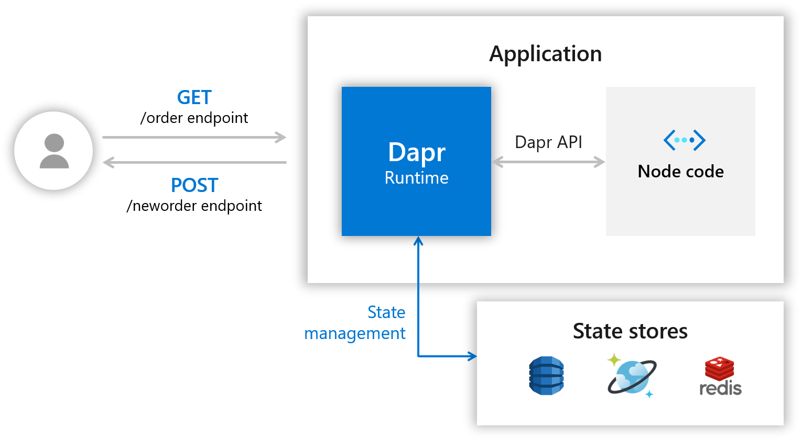

# Hello World

本教程将演示如何使Dapr在您的计算机上本地运行。

您将部署一个Node.js应用程序，该应用程序订阅订购消息并保留它们。

以下架构图说明了组成第一部分样本的组件：



之后，您将部署一个Python应用程序以充当发布者。 下面的架构图显示了新组件的添加： 


## 先决条件

本教程要求您在计算机上安装以下组件：

* Docker
* Node.js version 8 or greater https://nodejs.org/zh-cn/
* Python 3.x: https://www.python.org/downloads/ Note: When running this quickstart on Windows, it best to install Python from python.org rather than from the Windows store.
* Postman https://www.getpostman.com/ [Optional] 

## 第1步 - 设置Dapr

按照上一篇的内容下载并安装Dapr CLI并初始化Dapr。

## 第2步 - 了解代码

克隆代码到本地，并进入hello-world文件夹：
```shell
git clone --depth=1 https://github.com/dapr/quickstarts.git
cd quickstarts/hello-world
npm i
```

在其中，app.js您将找到一个简单的express应用程序，其中公开了一些路由和处理程序。

首先，看一下文件的顶部：

```js
const daprPort = process.env.DAPR_HTTP_PORT || 3500;
const stateStoreName = `statestore`;
const stateUrl = `http://localhost:${daprPort}/v1.0/state/${stateStoreName}`;
```

Dapr CLI 默认为 Dapr 创建了一个端口 3500。

接下来，看一下`neworder`处理程序：
```js
app.post('/neworder', (req, res) => {
    const data = req.body.data;
    const orderId = data.orderId;
    console.log("Got a new order! Order ID: " + orderId);

    const state = [{
        key: "order",
        value: data
    }];

    fetch(stateUrl, {
        method: "POST",
        body: JSON.stringify(state),
        headers: {
            "Content-Type": "application/json"
        }
    }).then((response) => {
        if (!response.ok) {
            throw "Failed to persist state.";
        }

        console.log("Successfully persisted state.");
        res.status(200).send();
    }).catch((error) => {
        console.log(error);
        res.status(500).send({message: error});
    });
});
```

这个接口，首先记录了传入的数据，然后将 订单ID 持久化到Redis中。

另外一个接口：

```js
app.get('/order', (_req, res) => {
    fetch(`${stateUrl}/order`)
        .then((response) => {
            if (!response.ok) {
                throw "Could not get state.";
            }

            return response.text();
        }).then((orders) => {
            res.send(orders);
        }).catch((error) => {
            console.log(error);
            res.status(500).send({message: error});
        });
});
```

这将调用edis缓存，以获得`order`的最新值，从而有效地使Node应用成为无状态应用。


## 第3步 - 使用Dapr运行Node.js应用

命令如下：
```shell
dapr run --app-id nodeapp --app-port 3000 --dapr-http-port 3500 node app.js
```
输出结果：
```
Starting Dapr with id nodeapp. HTTP Port: 3500. gRPC Port: 54032
== APP == Node App listening on port 3000!
…………
Updating metadata for app command: node app.js
You're up and running! Both Dapr and your app logs will appear here.

```

> 注意：`--app-port` 是可配置的，是可选的，如果未提供，则使用随机可用端口。

`dapr run` 命令将查找目录`~/.dapr/components`，Dapr在运行时使用的组件定义文件，都在这里。

我们看一下 `statestore.yaml` 的内容：

```yaml
apiVersion: dapr.io/v1alpha1
kind: Component
metadata:
  name: statestore
spec:
  type: state.redis
  metadata:
  - name: redisHost
    value: localhost:6379
  - name: redisPassword
    value: ""
  - name: actorStateStore
    value: "true"

```

您可以看到yaml文件将状态存储定义为Redis，并将其命名statestore。这就是app.js中调用状态存储所使用的名称。

```js
const stateStoreName = `statestore`;
const stateUrl = `http://localhost:${daprPort}/v1.0/state/${stateStoreName}`;
```

## 第4步 - 将消息发送到服务

现在，Dapr和Node.js应用程序正在运行，您可以使用不同的工具，对它发送POST消息。

* 命令行
```
dapr invoke --app-id nodeapp --method neworder --data "{\"data\": { \"orderId\": \"42\" } }"
```

* curl
```
curl -XPOST -d @sample.json -H "Content-Type:application/json" http://localhost:3500/v1.0/invoke/nodeapp/method/neworder
```

* Postman


## 第5步 - 确认成功的持久性

现在，要验证订单是否已成功保存到状态存储中，可以创建一个 GET 请求： http://localhost:3500/v1.0/invoke/nodeapp/method/neworder

* 命令行
```
dapr invoke --app-id nodeapp --method order --verb GET
```

* curl
```
curl http://localhost:3500/v1.0/invoke/nodeapp/method/order
```

* Postman


## 第6步 - 使用 Dapr 运行 Python 应用程序

通过这个 Python 应用程序，可以了解另一个应用程序，在不知道目标主机名或端口的情况下，如何通过 Dapr 调用节点应用程序。

在app.py文件中，您可以找到端点定义。
```
dapr_port = os.getenv("DAPR_HTTP_PORT", 3500)
dapr_url = "http://localhost:{}/v1.0/invoke/nodeapp/method/neworder".format(dapr_port)
```

Node应用程序的名字(nodeapp)在上面的url中，这一点很重要，这将允许 Dapr 将请求重定向到正确的 API 端点。
这个名字要跟上面练习中的名字一样。

下面的代码将每秒新增一个订单
```
n = 0
while True:
    n += 1
    message = {"data": {"orderId": n}}

    try:
        response = requests.post(dapr_url, json=message)
    except Exception as e:
        print(e)

    time.sleep(1)
```
接下来我们将运行这个Python程序

```
pip3 install requests

dapr run --app-id pythonapp python3 app.py

== APP == Got a new order! Order ID: 1
== APP == Successfully persisted state.
== APP == Got a new order! Order ID: 2
== APP == Successfully persisted state.
== APP == Got a new order! Order ID: 3
== APP == Successfully persisted state.
……………………

```


现在，执行几次 GET 请求并查看 orderId 每秒如何变化：
```
curl http://localhost:3500/v1.0/invoke/nodeapp/method/order

{"orderId":76}
```

## 第7步 - 清理

```
dapr stop --app-id nodeapp
dapr stop --app-id pythonapp
```
运行 dapr list 查看服务已停止运行。


## Next steps

Now that you've gotten Dapr running locally on your machine, consider these next steps:

* Explore additional quickstarts such as pub-sub, bindings or the distributed calculator app.
* Run this hello world application in Kubernetes via the Hello Kubernetes quickstart.
* Learn more about Dapr in the Dapr overview documentation.
* Explore Dapr concepts such as building blocks and components in the Dapr documentation.


