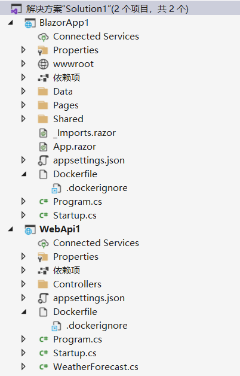
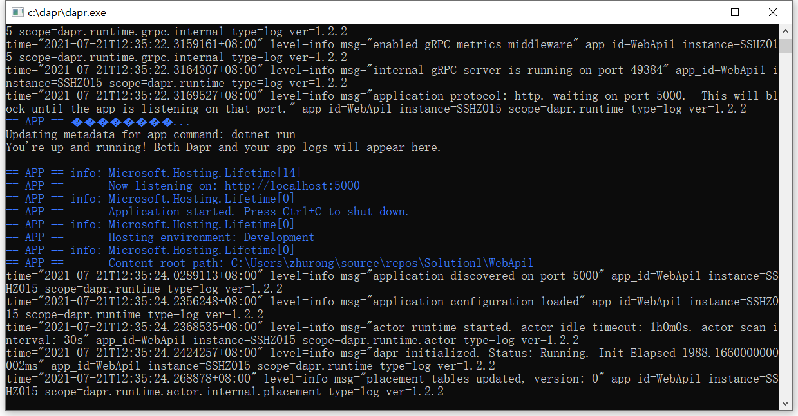
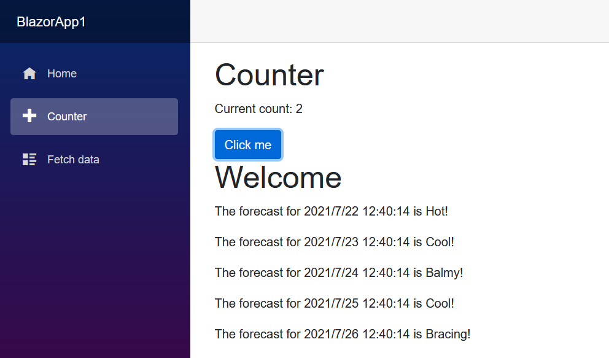
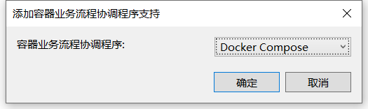
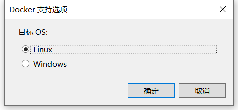
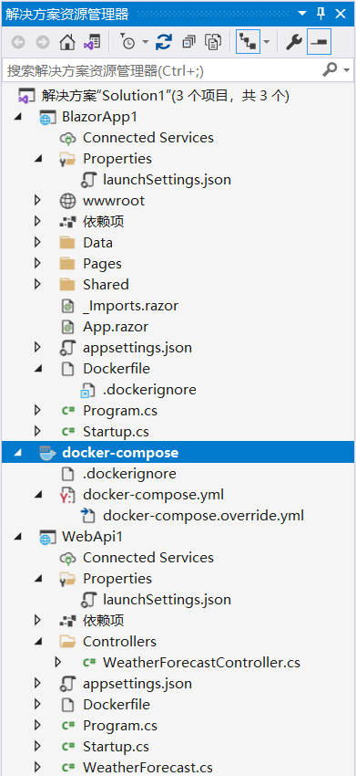

# Dapr for .Net

本篇将指导你在本地围绕 Dapr 开发环 .NET 应用程序。

从一个 Webapi 服务， 获得天气预报信息的 Blazor 应用程序，我们将构建一个基于 Dapr 服务调用的解决方案。


## 环境准备

首先，在开发计算机上安装 [Dapr](prerequisites) ，完成后可以在自承载模式下生成并运行 Dapr 应用程序。

## 创建 Web 应用程序

首先，我们创建一个空白的解决方案，然后逐个添加 Webapi1 项目和 BlazorApp1 项目：




## 添加 Dapr 服务调用

现在，我们将使用 Dapr 服务调用的能力配置服务之间的通信。 

Dapr 服务调用具有许多优点，它包括:服务发现、自动重试、使用 mTLS (消息加密) 以及改进的可观测性。 


1. 将 Dapr.AspNetCore 包添加到 Webapi1 项目：
```
dotnet add package Dapr.AspNetCore
```

2. 在 `Webapi1` 项目中，打开 `Startup.cs` 文件，将 `ConfigureServices` 方法替换为以下代码：
```CSharp
public void ConfigureServices(IServiceCollection services)
{
    services.AddControllers().AddDapr();
    services.AddRazorPages();
}
```

3. 在 `BlazorApp1` 项目中，打开 `Startup.cs` 文件，将 `ConfigureServices` 方法替换为以下代码：
```CSharp
public void ConfigureServices(IServiceCollection services)
{
    services.AddRazorPages().AddDapr();
    services.AddServerSideBlazor();
    services.AddSingleton<WeatherForecastService>();
}
```

4. 在 `BlazorApp1` 项目中，将 `Counter.razor` 的代码块(`Counter.razor.cs`)调整为如下内容：

```CSharp
using Dapr.Client;
using Microsoft.AspNetCore.Components;
using System;
using System.Collections.Generic;
using System.Linq;
using System.Net.Http;
using System.Threading.Tasks;

namespace BlazorApp1.Pages
{
    public partial class Counter
    {
        private int _currentCount = 0;

        private IEnumerable<WeatherData> allFlights = new List<WeatherData>();

        [Inject]
        private DaprClient _daprClient { get; set; }

        private async void IncrementCount()
        {
            _currentCount++;

            allFlights = await _daprClient.InvokeMethodAsync<IEnumerable<WeatherData>>(
                HttpMethod.Get,
                "webapi1",
                "weatherforecast");
        }

    }

    public class WeatherData
    {
        public DateTime Date { get; set; }

        public int TemperatureC { get; set; }

        public int TemperatureF { get; set; }

        public string Summary { get; set; }
    }
}
```

将 `DaprClient` 以属性注入的方式 添加到 Blazor 的page 中，在 `IncrementCount` 方法中，使用 `Dapr` 服务调用的能力调用 API 服务，每当用户点击 `Click me` 按钮时 ，都会使用 `DaprClient` 的 `InvokeMethodAsync` 方法调用 `WebApi1` 服务的 `weatherforecast` 方法。

5. 调整一下 `Counter.razor` ：

```html
@page "/counter"

<h1>Counter</h1>

<p>Current count: @_currentCount</p>

<button class="btn btn-primary" @onclick="IncrementCount">Click me</button>

<h1>Welcome</h1>

@foreach (var flight in allFlights)
{
    <p>The forecast for @flight.Date is @flight.Summary!</p>
}

```

## 使用 Dapr cli 调试服务

在 `Webapi1` 项目中，打开 `launchSettings.json` 文件，添加以下内容：

```json title="launchSettings.json"
{
  "profiles": {
    "dapr run": {
      "commandName": "Executable",
      "executablePath": "dapr",
      "commandLineArgs": "run --app-id WebApp1 --app-port 5000 --dapr-http-port 3500 dotnet run ",
      "workingDirectory": ".",
      "launchUrl": "swagger",
      "applicationUrl": "http://localhost:5000",
      "environmentVariables": {
        "ASPNETCORE_ENVIRONMENT": "Development"
      }
    }
  }
}
```

选择下面的调试项，启动 `Webapi1` 服务


输出结果如下：



再解决方案视图中，右键 `BlazorApp1` 项目，选择“启动新实例”，如果一切配置正确，应会看到天气预报数据：




## 使用 Docker-Compose 调试服务

在此示例的最后一部分，你将添加容器支持，然后使用 Docker Compose。

添加 Webapi1 项目和 BlazorApp1 项目：

1. 右键单击项目 BlazorApp1 ，然后选择"添加 > 容器业务流程协调程序支持"。 将显示 "添加容器业务流程协调程序支持 "对话框：



2. 下一个对话框中，选择 "Linux" 作为"目标 OS"：



Visual Studio解决方案中的 docker-compose 文件夹中创建 docker-compose.yml 文件和 .dockerignore 文件：



docker-compose.yml 文件包含以下内容：
```yml
version: '3.4'

services:
  blazorapp1:
    image: ${DOCKER_REGISTRY-}blazorapp1
    build:
      context: .
      dockerfile: BlazorApp1/Dockerfile
```

.dockerignore 文件包含你不希望 Docker 在容器中包含的文件类型和扩展名。  
这些文件与开发环境和源代码管理相关联，而不是与要部署的应用或服务相关联。

3. 在Webapi1 项目中，右键单击项目节点，然后选择"添加 > 容器业务流程协调程序支持"。 选择 Docker Compose"， 然后再次选择 "Linux" 作为目标 OS。

再次 打开 docker-compose.yml 文件并检查其内容。 Visual Studio更新了 Docker Compose 文件。 现在，这两个服务都包括在内：
```yml
version: '3.4'

services:
  blazorapp1:
    image: ${DOCKER_REGISTRY-}blazorapp1
    build:
      context: .
      dockerfile: BlazorApp1/Dockerfile

  webapi1:
    image: ${DOCKER_REGISTRY-}webapi1
    build:
      context: .
      dockerfile: WebApi1/Dockerfile

```

与此同时，在 Webapi1 项目和 BlazorApp1 项目目录的根目录中，VS帮我们创建了 Dockerfile。 Dockerfile 是一系列用于生成映像的命令。

4. 若要从容器化应用程序内部使用 Dapr 能力，需要将 Dapr sidecars 容器添加到 Compose 文件。 请仔细更新 docker-compose.yml 文件的内容，以匹配以下示例:
```yml
version: '3.4'

services:
  blazorapp1:
    image: blazorapp1
    build:
      context: .
      dockerfile: BlazorApp1/Dockerfile

  blazorapp1-dapr:
    image: "daprio/daprd:latest"
    command: [ "./daprd", "-app-id", "blazorapp1", "-app-port", "80"]
    depends_on:
      - blazorapp1
    network_mode: "service:blazorapp1"

  webapi1:
    image: webapi1
    build:
      context: .
      dockerfile: WebApi1/Dockerfile

  webapi1-dapr:
    image: "daprio/daprd:latest"
    command: [ "./daprd", "-app-id", "webapi1", "-app-port", "80"]
    depends_on:
      - webapi1
    network_mode: "service:webapi1"
```

在更新的文件中，我们分别为 BlazorApp1 和 WebApi1 服务添加了 sidecar。 在更新的文件中，请密切注意以下更改：

* `sidecar` 使用 `daprio/daprd:latest` 容器映像。  
不建议在生产环境中使用 `latest` 标记。对于生产环境最好使用特定的版本号。

* 出于网络隔离目的，Compose 文件中定义的每个服务都有自己的网络命名空间。  
`sidecar` 使用 `network_mode: "service:..."` 来确保它们在与应用程序相同的网络命名空间中运行。  
这样做可让 `sidecar` 和应用程序使用 `localhost` 进行通信  。

5. 运行解决方案 (F5 或 Ctrl+F5) 验证其是否正常工作。 如果一切配置正确，应会看到天气预报数据。如上。


## 总结

在本篇中，我们尝试了 Dapr .NET SDK，了解了 Dapr 如何与 .NET 应用程序平台集成。

示例展示了在 Docker 中运行的多容器应用，在 Visual Studio 2019 中通过 Docker Compose 尝试了我们熟知的 F5 调试体验。

在即将发布的章节中，你将深入了解 Dapr 的能力。


