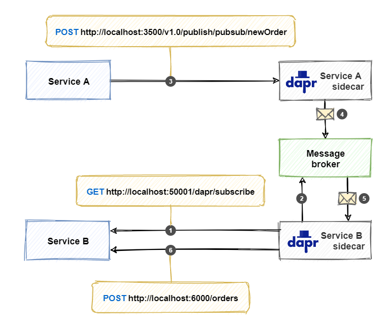
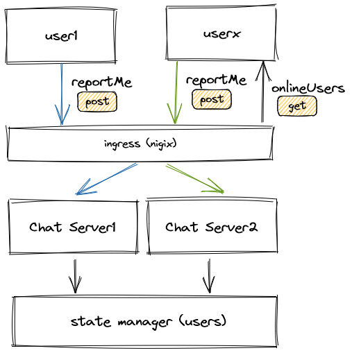
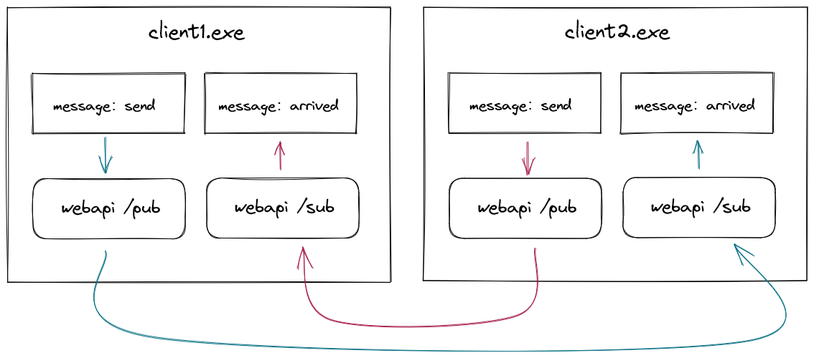

# 发布订阅

## 前言

`发布/订阅` 模式是众所周知且广泛使用的消息模式。 架构师通常在分布式应用程序中采用它。 

但是，实现此方法的管道可能会很复杂。在不同的消息传送产品中，通常会有细微的功能差异。 

大多数消息中间件可通过存储消息来保证 `持久性` 。当发布者发送消息时，订阅服务器无需立即可用，甚至不需要联机。

订阅者将接收并处理消息。Dapr 为消息传递保证 `至少一次` 语义。发布消息后，该消息将至少传递到任何相关订户。

:::note
如果服务只能处理一次消息，则需要提供 `幂等性检查` ，确保不会多次处理同一消息。 虽然这种逻辑可以编码，但某些消息中间件提供内置的 `重复检测` 消息传递功能。
:::

有很多商业的或开源的消息中间件产品，每个都有优点和缺点。我们在集成他们的同时，还要保持一定的抽象封装。抽象封装消息检测，并向系统提供基础的`发布/订阅`操作。对此，你需要编写和维护抽象及其基础实，需要自定义代码，这些代码可能会很复杂、并且容易出错。

Dapr 提供了一个构建基块，可显著简化实现 `发布/订阅` 功能。你和你的团队将重点放在创建可为客户带来价值的业务功能上，而不是编写消息传递管道代码。

下图演示了 `发布/订阅` 功能的工作原理：



1. `Service B sidecar` 作为消费从 `Service B` 调用接口 `/dapr/subscribe `，服务会帮它创建相关订阅；
2. `Service B sidecar` 在消息中间件上创建订阅；
3. `Service A` 向 `Service A sidecar` 的接口 `/v1.0/publish/<pub-sub-name>/<topic> `上发布一条消息；
4. `Service A sidecar` 将消息发布到消息中间件；
5. 消息中间件将消息副本发送给`Service B sidecar`；
6. `Service B sidecar` 调用 `Service B` 上的订阅相对应的端点（在本例中为 /orders）。`Service B` 使用 HTTP 状态代码进行响应 `200 OK` ，以便 `sidecar ` 将消息视为已成功处理。

## 特性

### 至少一次

Dapr 保证消息传递 `at-least-once` 语义。

这意味着，当应用程序使用 `发布/订阅` 将消息发布到主题时，Dapr 可确保此消息至少传递给每个订阅者一次。

### 竞争使用

横向伸缩消费者应用程序时，必须处理竞争性：只有一个应用程序实例应处理发送到主题的消息。 

Dapr 处理该问题时，当具有相同 `AppID` 的服务的多个实例，订阅同一个主题时，Dapr 只将每条消息传送给其中一个。

### 作用域

为了限制哪个应用程序可以发布或订阅 `topic`，Dapr 提供了 topic 作用域限定。

### 生命周期

Dapr 可以在每个消息的基础上设置超时时间，如果，消息未从 `发布/订阅` 组件读取，则消息将被丢弃。

这是为了防止未读消息的积累。在队列中超过配置的 TTL 的消息就可以说它过期了。

## 开发

### 配置组件

#### Localhost  

当在单机模式下使用 `dapr init` 时，Dapr CLI会自动提供一个状态存储(Redis)，并在components目录中创建文件`pubsub.yaml`

- 在Linux/MacOS上位于 `$HOME/.dapr/components`，
- 在Windows上位于 `%USERPROFILE%/.dapr/components`。

#### Kubernetes    

在 Kubernetes 中部署下面的文件  `kubectl apply -f pubsub.yaml`
```yaml title="pubsub.yaml"
apiVersion: dapr.io/v1alpha1
kind: Component
metadata:
  name: pubsub
  namespace: demo
spec:
  type: pubsub.redis
  version: v1
  metadata:
  - name: redisHost
    value: redis-master.dapr.svc.cluster.local:6379
  - name: redisPassword
    value: ""
```

### 注册服务

```js
var builder = WebApplication.CreateBuilder(args);

builder.Services.AddControllers().AddDapr(); // +
builder.Services.AddEndpointsApiExplorer();
builder.Services.AddSwaggerGen();

var app = builder.Build();

if (app.Environment.IsDevelopment())
{
    app.UseSwagger();
    app.UseSwaggerUI();
}

app.Urls.Add("http://localhost:5000");

app.UseAuthorization();

app.MapControllers();

app.UseCloudEvents(); // +
app.MapSubscribeHandler(); // +

app.Run();
```

`UseCloudEvents()` 将 `CloudEvents` 中间件添加到 ASP.NET Core 管道。 此中间件将使用 CloudEvents 解包结构化格式的请求，以便接收方法可以直接读取事件对象。

`MapSubscribeHandler()` 将订阅终结点，添加到路由配置中。此终结点将响应`/dapr/subscribe`上的请求。调用此终结点时，它将自动查找使用 `Topic` 属性修饰的所有 WebAPI 操作方法，并指示 Dapr 为这些方法创建订阅。


### 订阅消息

若要接收消息，需要将接口绑定到 `massage1` 主题：
```cs
[Topic("pubsub", "massage1")]
[HttpPost]
public async Task<ActionResult> Sub(WeatherForecast massage)
{
    await Task.Run(() =>
    {
        Console.WriteLine("reback: " + massage.Date.ToLongTimeString());
    });
    return Ok();
}
```
然后，Dapr 在接收该主题的消息时调用该操作方法。

:::caution 注意

`Sub`方法需要是 `HttpPost` 请求!  如果是 `HttpGet` 请求，则在运行过程中会遇到如下错误，导致消息无法正常收发。

"Error processing Redis message 1638682821965-0: retriable error returned from app while processing pub/sub event e869133a-d6e3-44cc-970b-2e44de6d75d6, topic: massage1, body: . status code returned: 405"
:::

### 发布消息

```js
[HttpGet]
public async Task<ActionResult> Pub()
{
    await _daprClient.PublishEventAsync<WeatherForecast>("pubsub", "massage1", 
        new WeatherForecast() { Date = DateTime.Now });
    return Ok();
}
```
- 第一个参数 `pubsub` 是 Dapr 的 `发布/订阅` 组件的名称；
- 第二个参数 `massage1` 提供要发送消息的主题的名称；
- 第三个参数 是消息包。 可以使用泛型类型参数指定消息的 .NET 类型。


## 衍生

还是拿聊天场景来举例，最初，我们有一个聊天服务器，



其中，ingress、server、state manager 确保了服务的高可用性。

基于本篇内容，我们其实也可以打造如下样子的系统，



在客户端程序中启动一个webapi，用来订阅其他客户端发布的消息。当收到消息之后，可以用一些常见的 `events` 组件再通知到窗口组件上。

:::tip 有什么不同？

这样的聊天系统直接演变成：去中心化的分布式系统！

:::