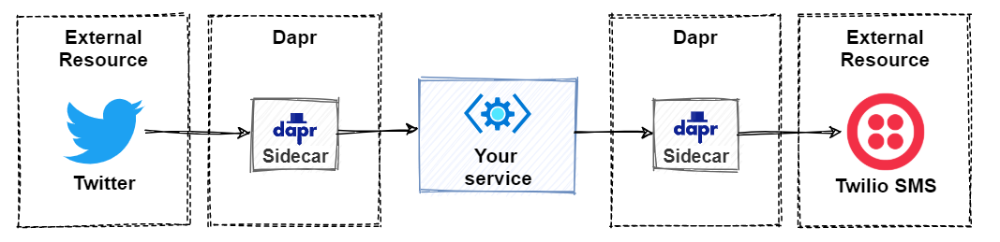
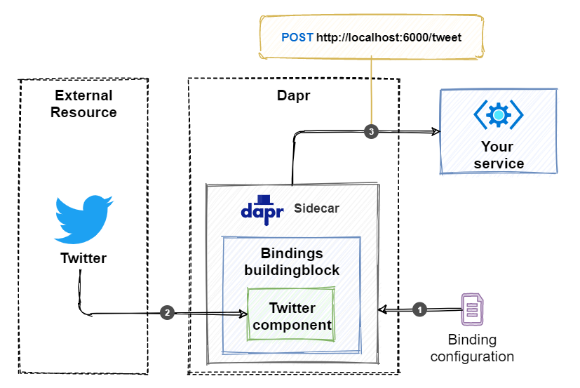

# 资源绑定

## 前言

大型系统建设，会遇到很多异构的系统：不同平台和供应商的数据存储、消息系统和 web 资源。

通过 Dapr `资源绑定`，你的业务服务可以直接与外部应用程序的外部资源集成。来自外部系统的事件可能会触发服务中传递上下文信息的操作。 然后，你的服务可以通过在另一个外部系统中触发事件来展开操作，同时传递上下文有效负载信息。 你的服务不需要耦合或识别外部资源就进行通信。 该管道封装在预定义的 Dapr 组件中。要使用的 Dapr 组件可在运行时轻松地进行交换，无需更改代码。

下图显示了此操作的一般逻辑：



:::tip 
乍一看，资源绑定行为可能与本书前面介绍的 *发布订阅* 模式类似。 尽管它们有相似之处，但也有不同之处。*发布订阅* 侧重于服务之间的异步通信。 资源绑定具有更大的范围。 它侧重于软件平台之间的系统互操作性。 在不同的应用程序、数据存储和微服务应用程序之外的服务之间交换信息。
:::

## 特性

### 输入绑定

输入绑定通过外部资源的传入事件消息。 若要接收事件和数据，请从服务中注册一个将成为 事件处理程序 的公共终结点。 如下图：



1. Dapr sidecar 读取绑定配置文件，并订阅为外部资源指定的事件。 在此示例中，事件源是一个 Twitter 帐户。
2. 当在 Twitter 上发布了匹配的推文时，在 Dapr sidecar 中运行的绑定组件会选取它并触发一个事件。
3. Dapr sidecar 调用事件处理程序 `/tweet` ，这必须是一个 `HttpPost` 操作。
4. 处理事件后，服务将返回 HTTP 状态码 `200 OK` 。

### 输出绑定

输出绑定能够触发调用外部资源事件。 同样，需要先编写绑定配置 YAML 文件。一旦触发一个事件，该事件在应用程序的 Dapr sidecar 上调用绑定 API。如下图：


1. Dapr 读取绑定配置文件，其中包含有关如何连接到外部资源的信息。 在此示例中，外部资源是 Twilio 的 SMS 帐户。
2. 应用程序调用 sidecar 的 `/v1.0/bindings/sms` 。 在这种情况下，它使用 HTTP POST 来调用 API。 还可以使用 gRPC。
3. 在 Dapr sidecar 中运行的绑定组件会调用外部消息系统来发送消息。 消息将包含 POST 请求中传递的数据。


## 开发

本篇基于 MQTT 消息中间件技术，讲解如何开发.net服务。

### 前置条件

部署MQTT消息服务：
```
docker run -d --name emqx -p 1883:1883 -p 18083:18083 emqx/emqx
```
:::tip
EMQ X 是一款完全开源，高度可伸缩，高可用的分布式 MQTT 消息服务器，适用于 IoT、M2M 和移动应用程序，可处理千万级别的并发客户端。
:::


### 配置组件

#### Localhost  

当在单机模式下使用 `dapr init` 时，Dapr CLI会自动提供一个状态存储(Redis)，并在components目录中创建文件`binding.yaml`

- 在Linux/MacOS上位于 `$HOME/.dapr/components`，
- 在Windows上位于 `%USERPROFILE%/.dapr/components`。

#### Kubernetes    

在 Kubernetes 中部署下面的文件  `kubectl apply -f binding.yaml`
```yaml title="binding.yaml"
apiVersion: dapr.io/v1alpha1
kind: Component
metadata:
  name: mybinding
spec:
  type: bindings.mqtt
  version: v1
  metadata:
  - name: url
    value: mqtt://localhost:1883
  - name: topic
    value: mytopic
  - name: consumerID
    value: "{uuid}"
```

:::tip 其他配置详见这里

https://docs.dapr.io/reference/components-reference/supported-bindings/mqtt/#spec-metadata-fields

:::


### 订阅消息

```js
[HttpPost("/mybinding")]
public ActionResult MsgIn([FromBody] WeatherForecast data)
{
    Console.WriteLine($"message received at {data.Date.ToLongTimeString()}.");
    return Ok();
}
```

:::caution 注意

`MsgIn`方法需要是 `HttpPost` 请求，参数在Body里面。

:::


在上面的示例中，Dapr 将在事件发生是调用 /mybinding 接口。

### 发布消息

```js
[HttpGet]
public async Task<ActionResult> MsgOut()
{
    await _daprClient.InvokeBindingAsync("mybinding", "create", new WeatherForecast { Date = DateTime.Now });
    return Ok();
}
```

> 上面的示例中，`create` 为消息中间件的操作。 常见操作包括：`create`、`get`、`delete`、`list`。

通过swagger发送消息，同时你也会收到如下消息：

```
== APP == message received at 12:57:31.
```
