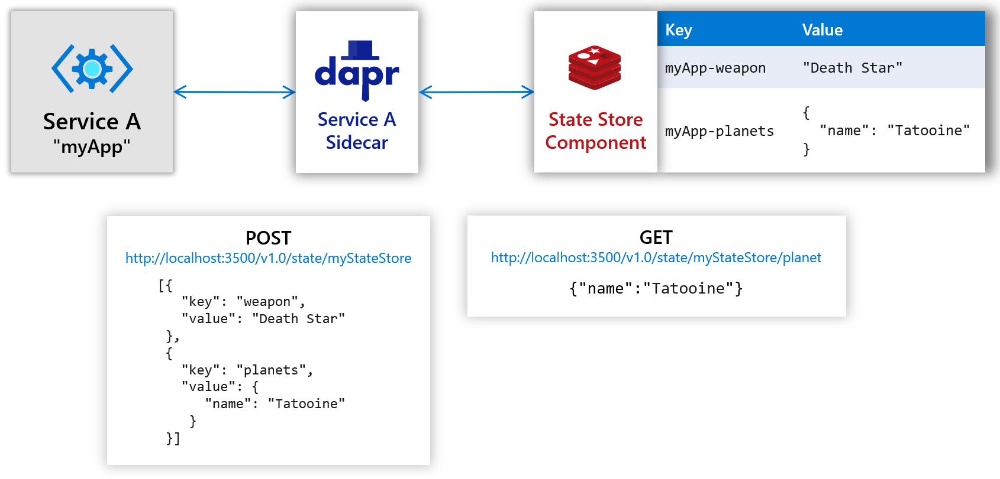
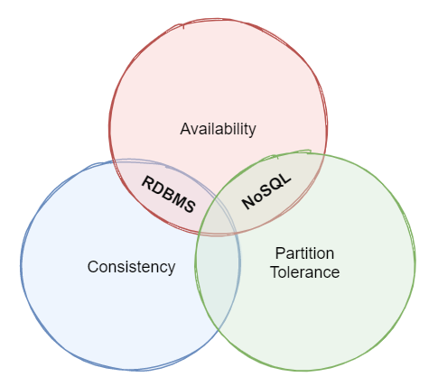
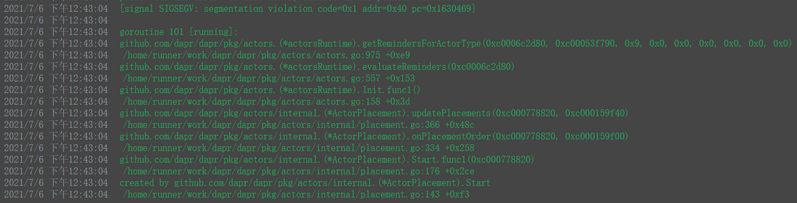

# 状态管理

## 前言

有状态的服务本质上是一些有状态对象的集合，这些对象状态的变化只发生在当前服务进程中。

举一个很简单的栗子：我们平时玩的斗地主游戏，三个玩家，当有一个玩家因为网络原因掉线，经过一段时间，这个玩家又重新上线，需要根据某些记录来恢复玩家掉线期间系统自动出牌的记录，这些出牌记录在这个业务中其实就是这个玩家的状态变化记录。在有状态的服务中，很容易做到这一点。

有状态的服务在设计难度上比无状态的服务要大很多，不仅仅是因为开发设计人员需要更好的抽象能力，更多的是一致性的设计问题。

现代的分布式系统，都是由多个服务器组成一个集群来对外提供服务，当一个对象在服务器 A 产生之后，如果请求被分配到了服务器 B 上，这种情况下有状态的服务毫无意义，为什么呢？当一个相同的业务对象存在于不同的服务器上的时候，本质上就违背了现实世界的规则，你能说一个人，即出生在中国，又出生在美国吗？ 

所以有状态的服务对于一致性问题有着天然的要求，这种思想和微服务设计理想不谋而合。因此，有状态的服务对于同一个对象的横向扩容是做不到的，就算是做的到，多个相同对象之间的状态同步工作也必然会花费更多的资源。在很多场景下，有状态的服务要注意热点问题，例如最常见的秒杀，这里并非是说有状态服务不适合大并发的场景，反而在高并发的场景下，有状态的服务往往表现的比无状态服务更加出色。

分布式应用程序中的跟踪状态可能具有挑战性。 例如：

* 访问和更新数据时可能需要不同的一致性级别。
* 多个用户可以同时更新数据，需要冲突解决。
* 在与数据存储交互时，服务必须重试任何暂时性错误。

对于这些情况， Dapr 提供了状态管理的能力，并提供了跨各种数据存储的高级功能。

)

Dapr 状态管理构建块解决了这些难题。 它简化了跟踪状态，而无需依赖关系或学习曲线在第三方存储 Sdk 上。


## 特性

### 一致性

[CAP 定理](https://en.wikipedia.org/wiki/CAP_theorem) 是一组适用于存储状态的分布式系统的原则。 下图显示了 CAP 定理的三个属性。



定理指出，分布式数据系统提供一致性、可用性和分区容差之间的权衡。 而且，任何数据存储只能保证三个属性中的两个：

* **一致性** (C) : 群集中的每个节点都将使用最新的数据做出响应，即使在所有副本更新之前，系统都必须阻止请求。 如果查询当前正在更新的项的 "一致性系统"，则在所有副本都成功更新之前，将不会收到响应。 但是，您将始终接收最新的数据。

* **可用性** (A) : 即使该响应不是最新的数据，每个节点都将返回立即响应。 如果您在 "可用系统" 中查询正在更新的项，则您将获得该服务在此时可以提供的最佳可能的答案。

* **分区容差** (P) : 即使复制的数据节点发生故障或失去与其他复制的数据节点的连接，保证系统仍可继续运行。

分布式应用程序必须处理 P 属性。 随着服务彼此间的网络调用通信，会发生网络中断 (P) 。 考虑到这一点，分布式应用程序必须是 AP 或 CP。

Dapr同时支持强一致性 (CP) 和最终一致性 (AP) ，其中最终一致性为默认行为。

当使用强一致性时，Dapr会等待所有副本确认后才会确认写入请求。 

当最终使用一致性时，Dapr 将在基本数据存储接受写入请求后立即返回，即使这是单个副本。

### 并发

在多用户系统中，有可能多个用户同一时间操作同一数据。 通常采用乐观并发控制 (OCC) 来管理冲突。 Dapr 支持使用 `Etags` 的乐观并发控制（OCC）。 ETags 是特定版本的 `key/value` 数据。 `key/value` 的每次更新，`ETag` 值也会更新。 当客户端检索`key/value`时，响应包括当前 `ETag` 值。 当客户端更新或删除`key/value`时，它必须在请求正文中发送回该 `ETag` 值。 如果其他客户端同时更新了数据，则 `Etag` 不会匹配，请求将失败。 此时，客户端必须检索更新的数据，重新进行更改，然后重新提交更新。 此策略称为 `first-write-wins`。

Dapr 还支持 `last-write-wins` 策略。 使用此方法时，客户端不会将 `ETag` 附加到写入请求。 状态存储组件将始终允许更新，即使基础值在会话期间已更改也是如此。 `last-write-wins` 对于数据争用较少的高吞吐量写入方案非常有用。 同样，可以容忍偶尔的用户更新。

## 开发

### 配置状态存储

状态存储组件代表Dapr用来与数据库进行通信的资源。

作为演示目的，本篇采用Redis作为存储源，其他存储源请参考这个 [清单](https://docs.dapr.io/zh-hans/reference/components-reference/supported-state-stores/)。


#### Localhost  

当在单机模式下使用 `dapr init` 时，Dapr CLI会自动提供一个状态存储(Redis)，并在components目录中创建相关的YAML
- 在Linux/MacOS上位于 `$HOME/.dapr/components`，
- 在Windows上位于 `%USERPROFILE%/.dapr/components`。  

#### Kubernetes    

在 Kubernetes 中部署，需要编写下面的文件，可以命名为 `statestore.yaml`  
```
apiVersion: dapr.io/v1alpha1
kind: Component
metadata:
  name: statestore
  namespace: masa-stack
spec:
  type: state.redis
  version: v1
  metadata:
  - name: redisHost
    value: redis-master.dapr.svc.cluster.local:6379
  - name: redisPassword
    value: ""
  - name: actorStateStore
    value: "true"
```
然后注入到K8S中 `kubectl apply -f statestore.yaml` 。

**注意：** 最初，参考官方配置，我们认为，命名空间不选，或者选择dapr命名空间，才是合理的，这会导致下面的问题：



通过反复调试，发现，该组件的命名空间，需要跟业务服务在一起！
```
namespace: masa-stack
```

### 读写单个状态

下面的示例演示如何使用Dapr从状态存储读取数据。

#### 通过curl命令

* 写状态
```shell
curl -X POST -H "Content-Type: application/json" -d '[{ "key": "key1", "value": "value1"}]' http://localhost:3500/v1.0/state/statestore
```

* 读状态
```shell
curl http://localhost:3500/v1.0/state/statestore/key1
```

#### 通过.Net SDK

* 读状态
```C#
var weatherForecast = await daprClient.GetStateAsync<WeatherForecast>("statestore", "AMS");
```

* 写状态  
```C#
daprClient.SaveStateAsync("statestore", "AMS", weatherForecast);
```
该示例使用 "last-write-wins" 策略，因为 ETag 值不会传递给状态存储组件。 

若要将乐观并发控制 (OCC) "first-write-wins" 策略，请先使用 `DaprClient.GetStateAndETagAsync` 获得 `ETag`， 然后使用 `DaprClient.TrySaveStateAsync` 方法写入更新后的值，并传递先前的`ETag`。如下：

```C#
var (weatherForecast, etag) = await daprClient.GetStateAndETagAsync<WeatherForecast>("statestore", city);

// ... make some changes to the retrieved weather forecast

var result = await daprClient.TrySaveStateAsync("statestore", city, weatherForecast, etag);
```

`DaprClient.TrySaveStateAsync` 方法会返回一个布尔值，指示调用是否成功。 

处理失败的一种策略是，只需从状态存储重新加载更新后的数据，再次进行更改，然后重新提交更新。

如果始终希望写入成功，而不考虑对数据的其他更改，请使用 "last-write-wins" 策略。

### 读写多个状态

Dapr还允许你在同一个调用中读写多个状态。

#### 通过curl命令

* 写状态
```shell
curl -X POST http://localhost:3500/v1.0/state/statestore \
    -H "Content-Type: application/json" \
    -d '[{ "key": "Key1", "value": "Value1" },{ "key": "Key2", "value": "Value2" }]'
```

* 读状态
```shell
curl -X POST  http://localhost:3500/v1.0/state/statestore \
    -H "Content-Type: application/json" \
    -d '{"keys":["key1", "key2"]}'
```

